# ☁️ AWS Academy Lab - Amazon S3 Storage Management

## 📖 Overview

This lab demonstrates how to configure and manage an Amazon S3 bucket, including static website hosting, bucket policies, object versioning, lifecycle management, and cross-region replication.

---

# 🏗️ AWS Services Used

- Amazon S3
- Bucket Policy
- Static Website Hosting
- Object Versioning
- Lifecycle Rules
- Cross-Region Replication (CRR)

---

# 🎯 Objectives

- Create an S3 bucket
- Configure bucket permissions
- Enable Static Website Hosting
- Configure Bucket Policy
- Upload website files
- Enable Object Versioning
- Create Lifecycle Rules
- Create a Backup Bucket
- Configure Cross-Region Replication

---

# 📝 Lab Steps

## Step 1 — Create an Amazon S3 Bucket

A new bucket named **cafe-ahmed-2026** was created with the required configuration.

- Bucket Name
- ACL Enabled
- Public Access configured
- Default Encryption enabled

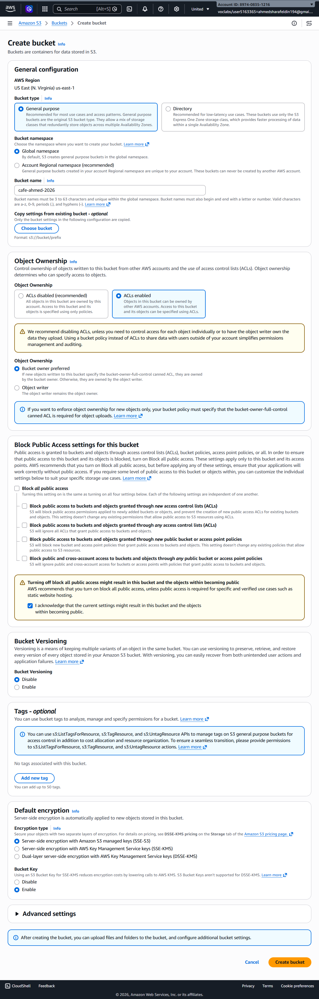

---

## Step 2 — Verify Bucket Creation

The bucket was successfully created and is ready to store objects.

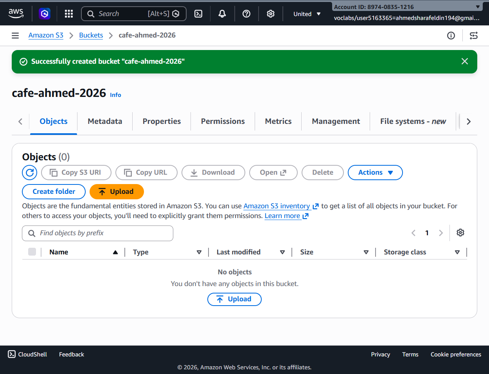

---

## Step 3 — Enable Static Website Hosting

Static Website Hosting was enabled.

Configuration:

- Host a Static Website
- Index Document: `index.html`

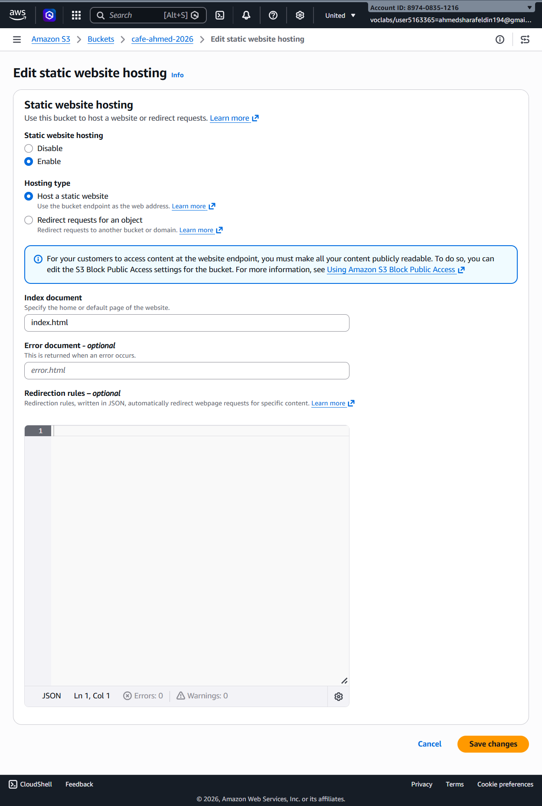

---

## Step 4 — Initial Website Access Test

The website endpoint initially returned a **403 Access Denied** error because public access permissions had not yet been configured.

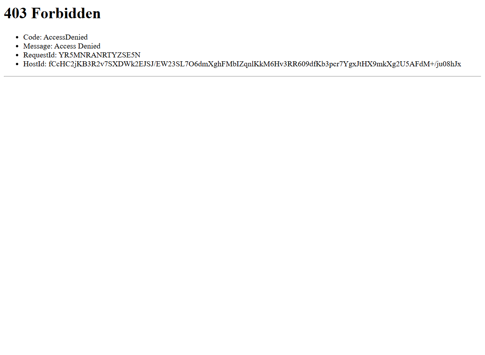

---

## Step 5 — Configure Bucket Policy

A public read Bucket Policy was applied to allow website visitors to access the uploaded files.

Additional permissions and ACL settings were also verified.

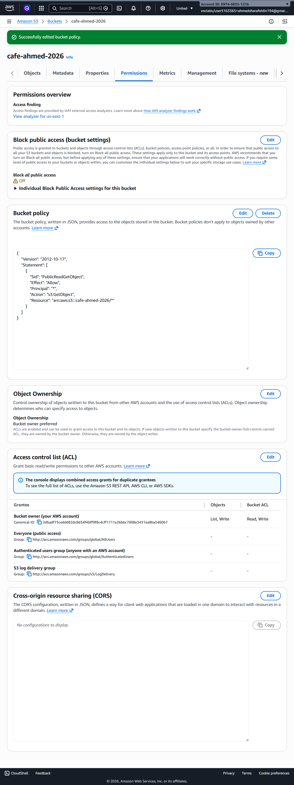

---

## Step 6 — Upload Website Files

Website content was uploaded to the bucket, including:

- index.html
- css/
- images/

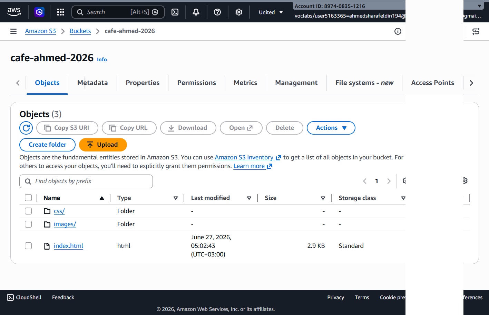

---

## Step 7 — Enable Object Versioning

Versioning was enabled to preserve multiple versions of uploaded objects.

This provides protection against accidental deletion or overwriting.

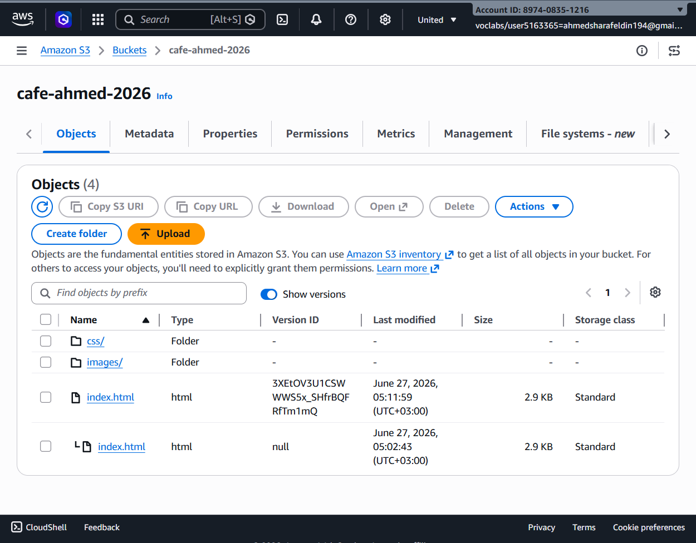

---

## Step 8 — Create Lifecycle Rule

A Lifecycle Rule named **Move-Old-Versions** was created.

Configuration:

- Transition Noncurrent Versions
- Move to Standard-IA
- After 30 Days

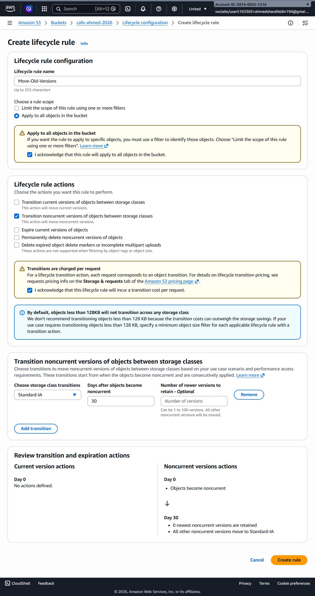

---

## Step 9 — Verify Lifecycle Rules

The configured lifecycle rules were successfully added and enabled.

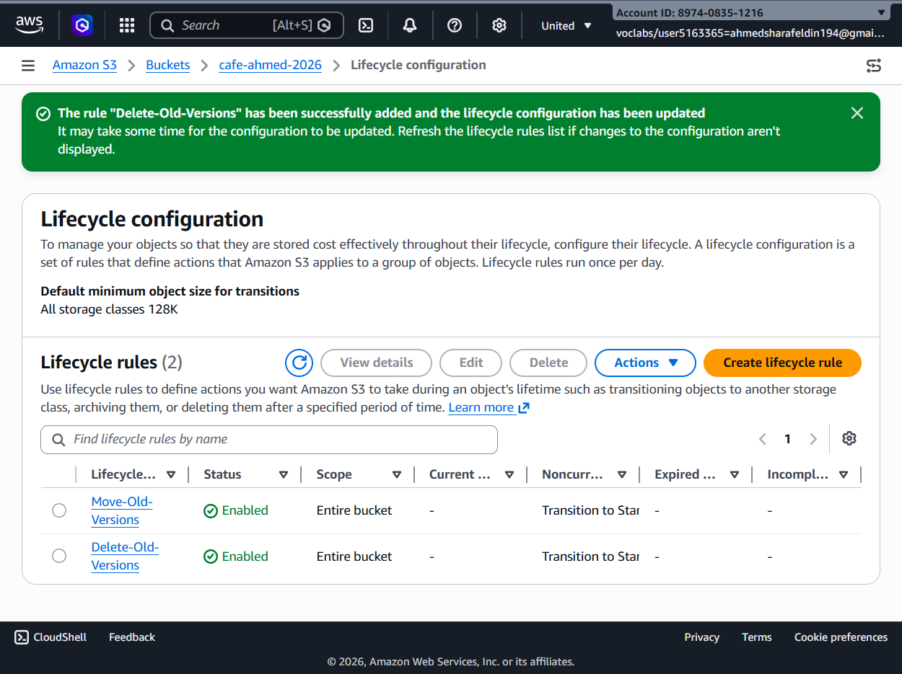

---

## Step 10 — Create Backup Bucket

A second bucket named **cafe-ahmed-backup-2026** was created to receive replicated objects.

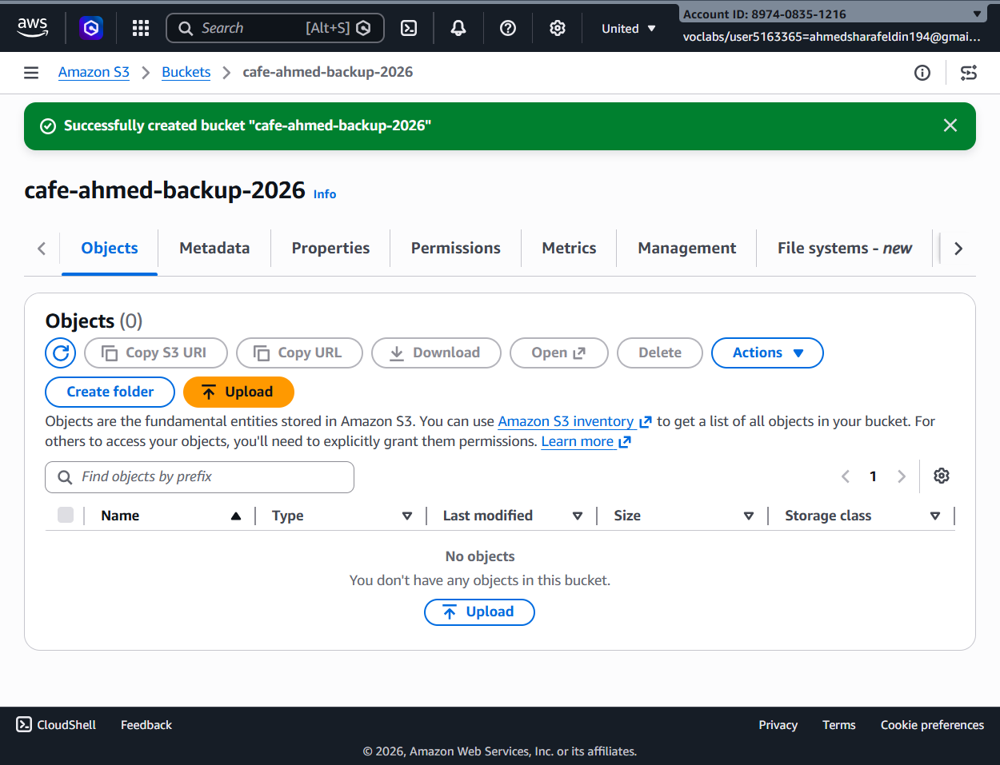

---

## Step 11 — Configure Cross-Region Replication

Cross-Region Replication (CRR) was configured.

Configuration included:

- Source Bucket
- Destination Bucket
- IAM Replication Role
- Replication Rule
- Destination Region

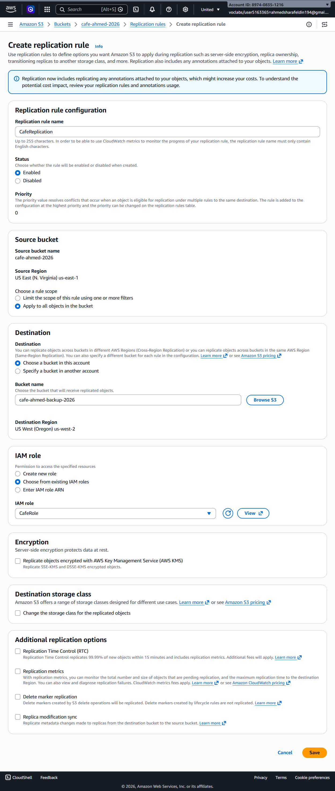

---

# ✅ Results

The lab successfully demonstrated:

- Amazon S3 Bucket Creation
- Bucket Policies
- Static Website Hosting
- Public Website Access
- Object Versioning
- Lifecycle Management
- Backup Bucket Creation
- Cross-Region Replication

---

# 🔒 AWS Concepts Demonstrated

- Amazon S3
- Bucket Policy
- Static Website Hosting
- Object Versioning
- Lifecycle Rules
- Cross-Region Replication
- High Availability
- Data Durability
- Disaster Recovery

---

# 🎓 Conclusion

Amazon S3 provides secure, scalable, and highly durable object storage. By combining Static Website Hosting, Versioning, Lifecycle Management, and Cross-Region Replication, organizations can build highly available, resilient, and cost-optimized storage solutions while protecting data against accidental loss and regional failures.