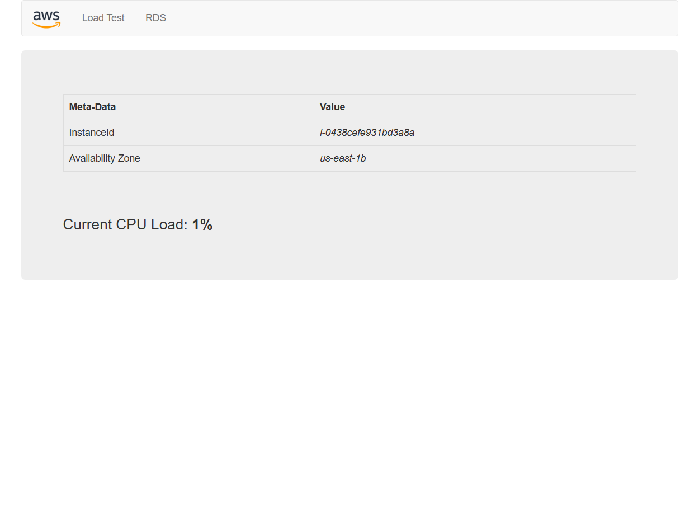
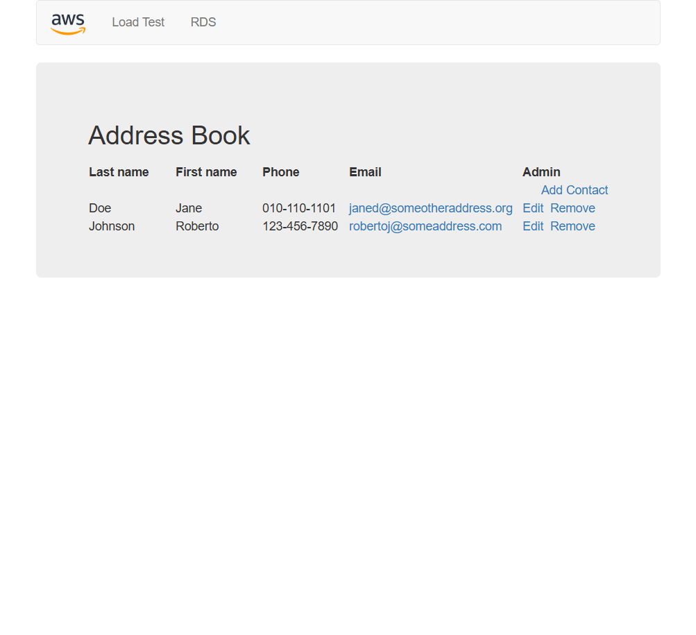
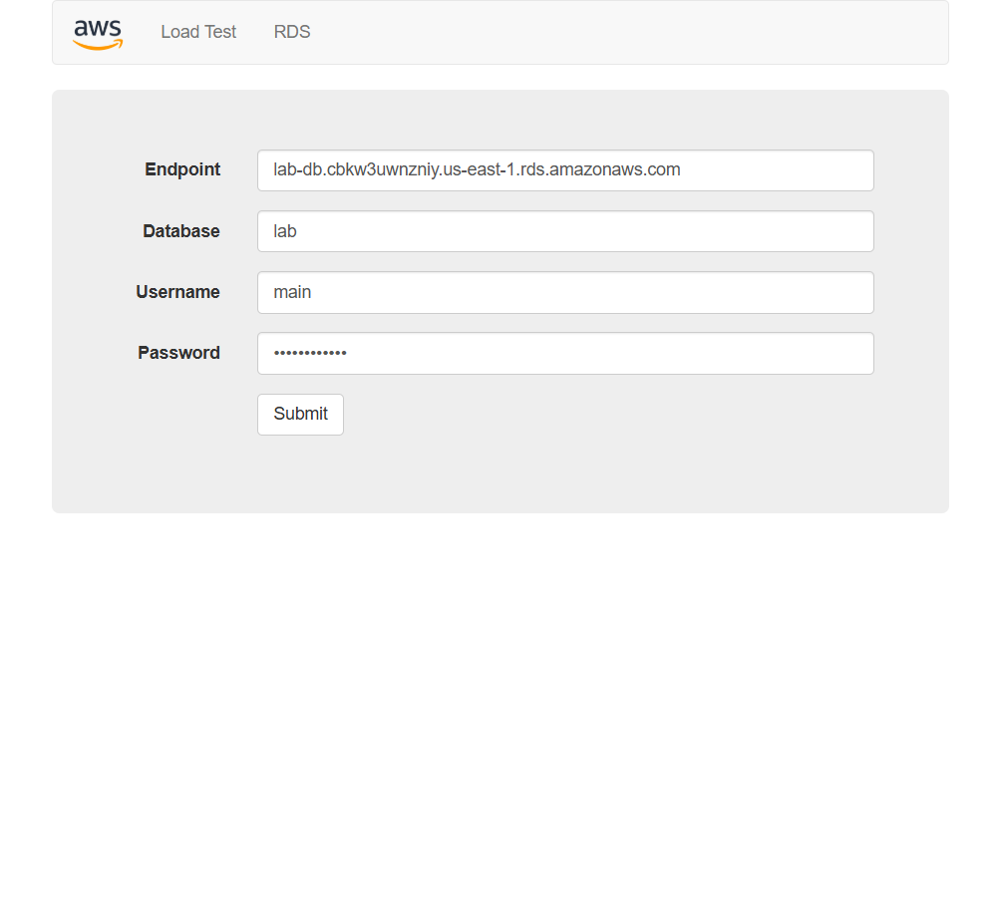
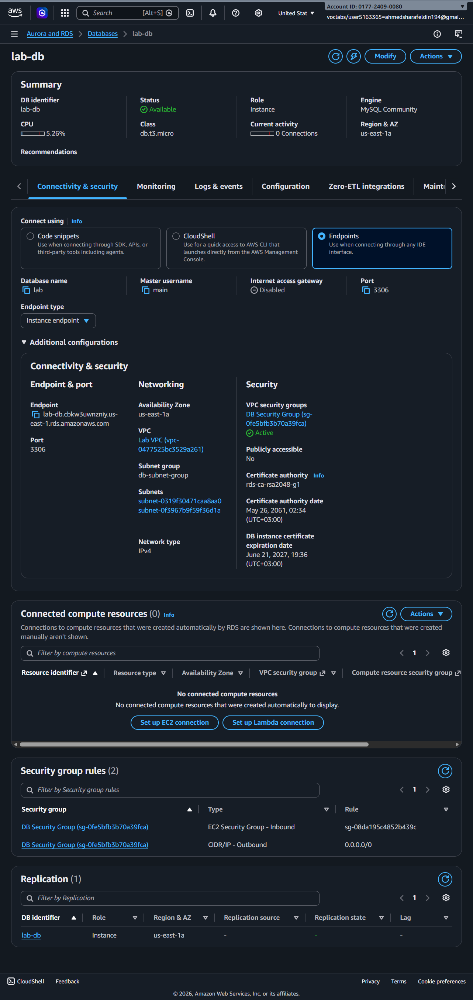
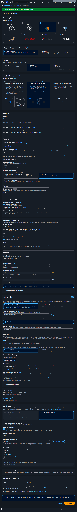
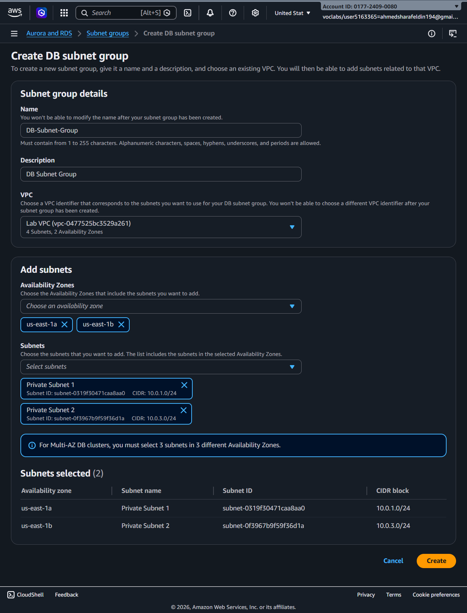
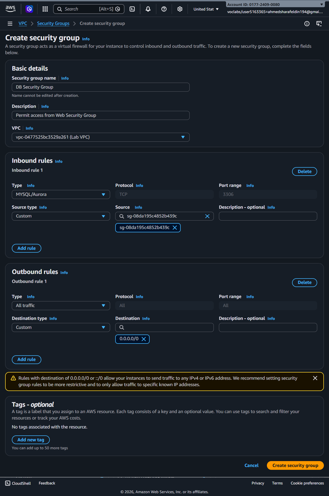

# AWS RDS Database Deployment Lab

This project demonstrates the deployment of an Amazon RDS MySQL database inside a custom VPC, secured using Security Groups and DB Subnet Groups. The lab also verifies connectivity through a sample Address Book application and Load Test dashboard.

---

## Step 1 – Create Database Security Group

Create a dedicated Security Group for the database instance and allow MySQL access (Port 3306) only from the Web Security Group.

---

## Step 2 – Create DB Subnet Group

Create a DB Subnet Group using private subnets located in different Availability Zones.

---

## Step 3 – Create Amazon RDS MySQL Instance

Launch a MySQL database instance and configure networking, credentials, storage, and security settings.

---

## Step 4 – Verify Database Availability

Wait until the database status changes to **Available** and verify connectivity and security settings.

---

## Step 5 – Connect Application to RDS

Configure the application using the RDS endpoint, database name, username, and password.

---

## Step 6 – Verify Application Functionality

Confirm that the Address Book application successfully retrieves records from the RDS database.

---

## Step 7 – Verify Load Test Dashboard

Validate the Load Test page and monitor application performance and instance metadata.

---

## AWS Services Used

- Amazon RDS (MySQL)
- Amazon VPC
- Security Groups
- DB Subnet Groups
- EC2 Instance
- Route Tables
- Private Subnets

---

## Outcome

Successfully deployed a secure Amazon RDS MySQL database inside a private subnet architecture and connected it to a web application running on Amazon EC2.