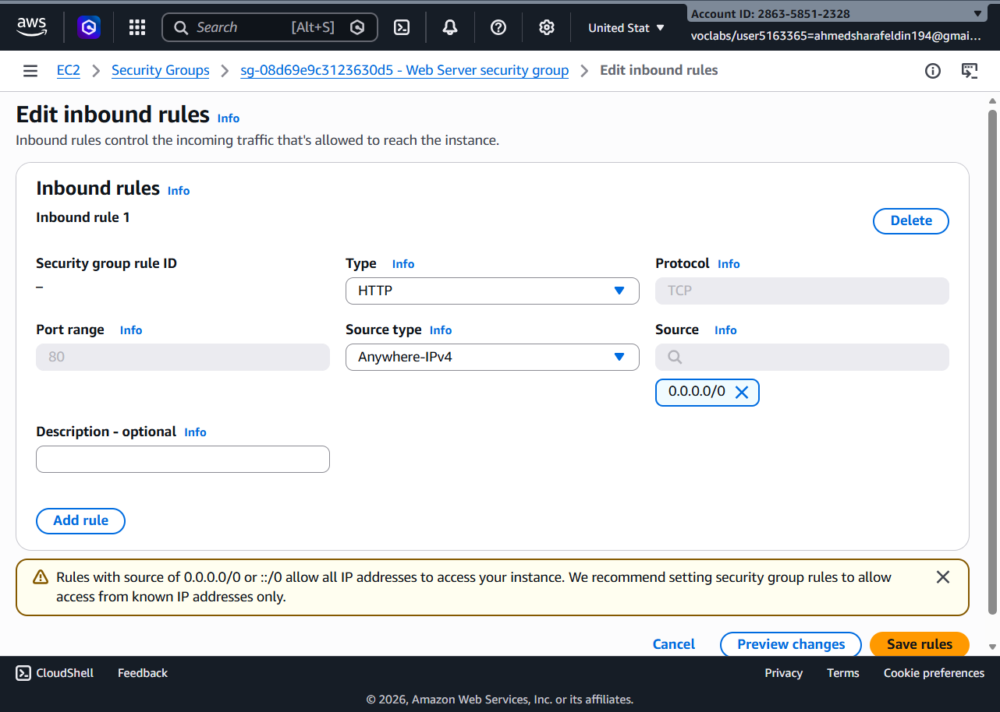
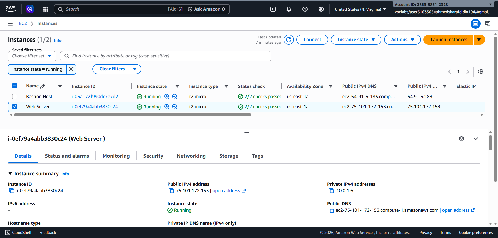
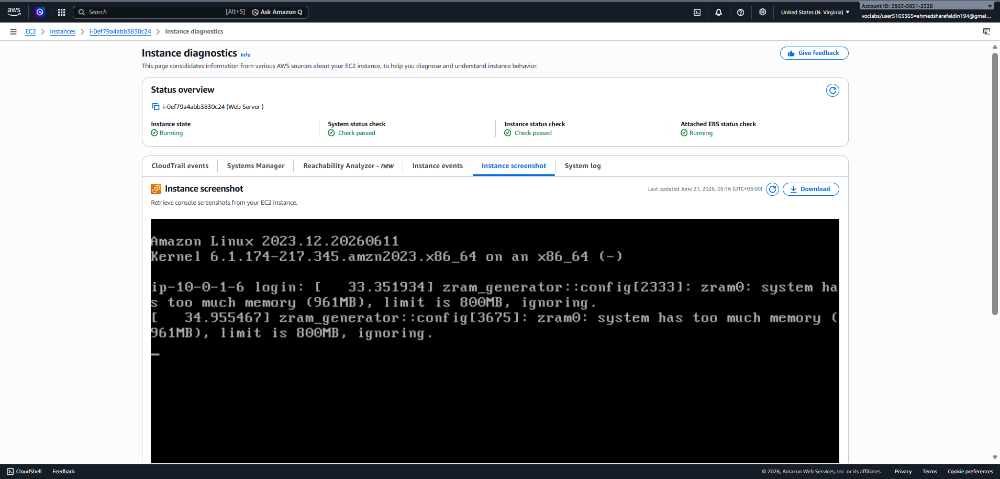
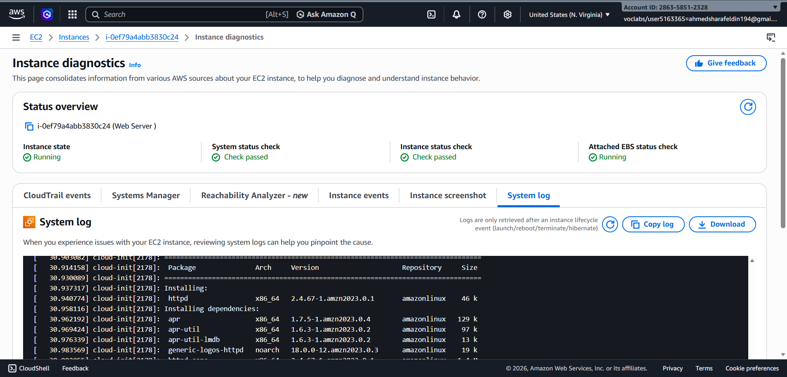
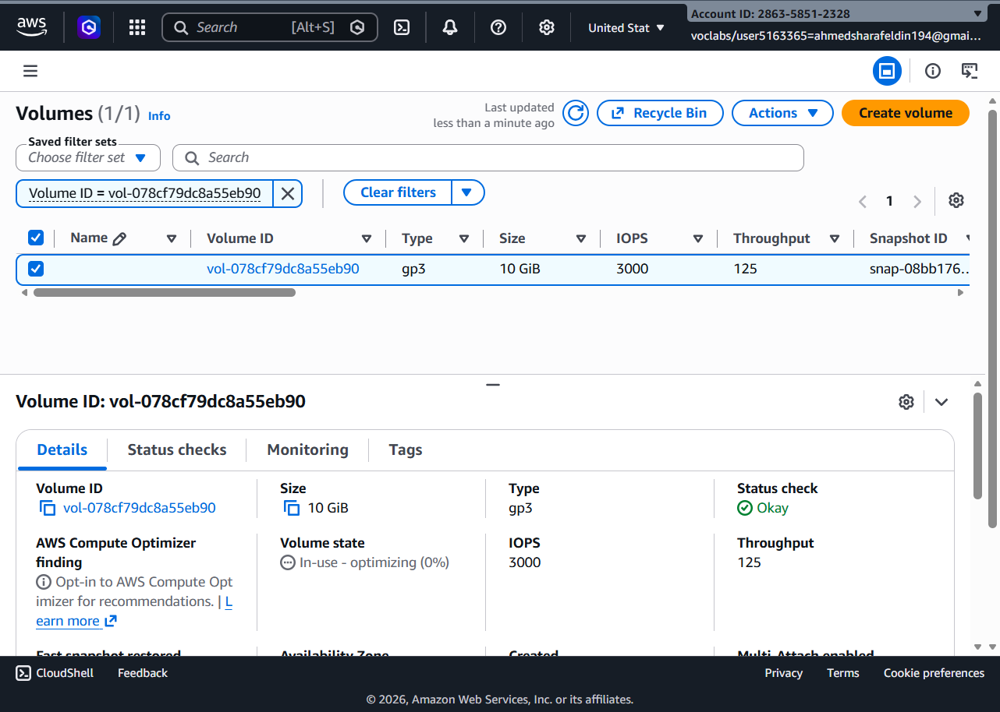
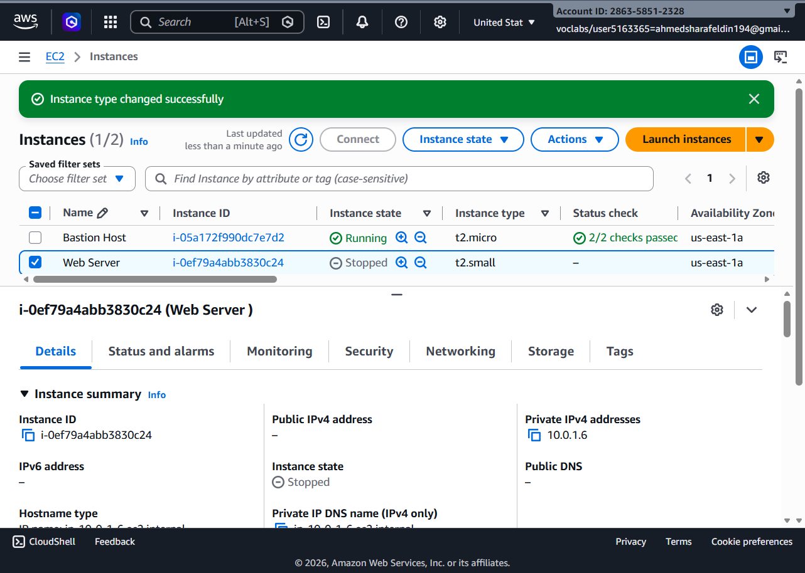
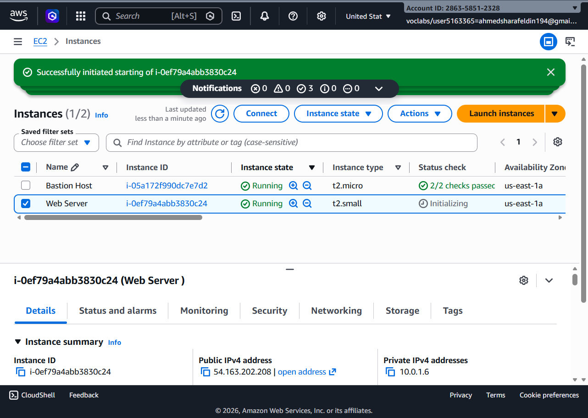
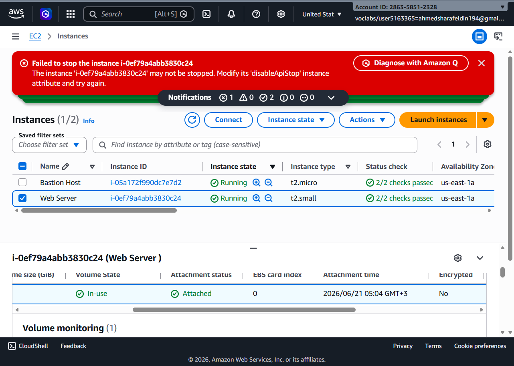

# AWS Academy Lab - Monitor an EC2 Instance

## Task 1 – Configure Security Group

The security group was configured to allow HTTP traffic on port 80 from Anywhere IPv4.

---

## Task 2 – Verify EC2 Instance Configuration

The instance details were reviewed to verify networking and addressing information.

---

## Task 3 – Validate Web Server Access

The public IP address was tested using a web browser.

The default Apache web page was displayed successfully.

---

## Task 4 – Review Instance Diagnostics

Instance diagnostics were checked to verify instance health.

---

## Task 5 – Review System Logs

System logs were inspected to verify successful web server installation.

---

## Task 6 – Review Attached EBS Volume

The attached EBS storage volume was inspected.

---

## Task 7 – Modify Instance Type

The EC2 instance type was changed from t2.micro to t2.small.

---

## Task 8 – Start Instance After Modification

The instance was started again after the instance type modification.

---

## Task 9 – Verify Stop Protection

An attempt was made to stop the instance.

AWS prevented the operation because Stop Protection was enabled.

---

## Conclusion

This lab demonstrated:

- EC2 instance management
- Security Group configuration
- Web server deployment
- Instance monitoring and diagnostics
- System log analysis
- EBS volume inspection
- Instance type modification
- Stop protection functionality